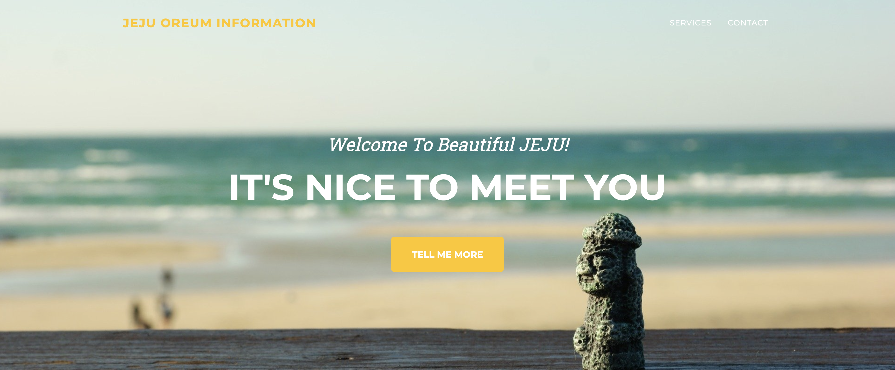
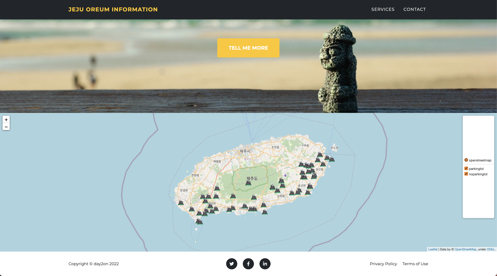
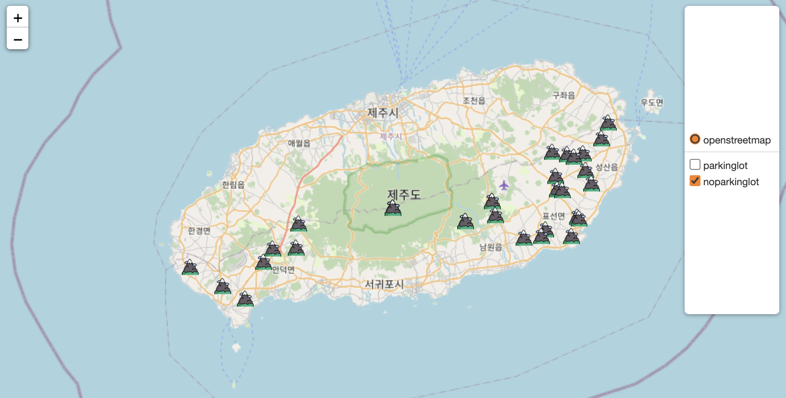
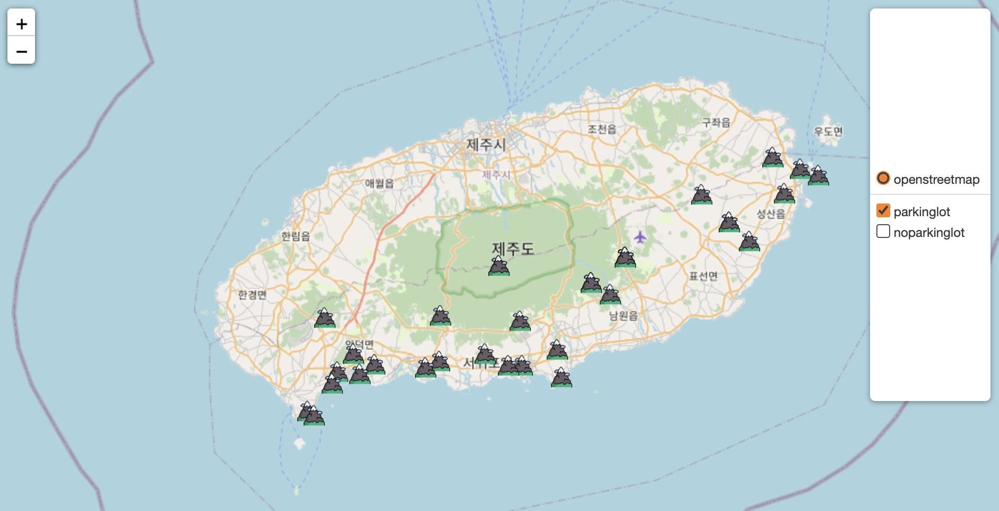

# Jeju-Oreum-Map ⛰

✔️ 공공데이터를 활용하는 법을 학습하기 위한 클론 코딩

[inflearn: 공공데이터와 Folium(Python)으로 만드는 제주🏝 오름 지도 안내 서비스](https://www.inflearn.com/course/파이썬-폴리움-지도서비스/dashboard)

## Screen shots 📸
### Pages
| Main |
|:-------------:|
||
| Information Map |
||

---
### Information Map 🗺 details
| with parking lot 🚘 |
|:-------------:|
||
| without parking lot 🚶|
||
